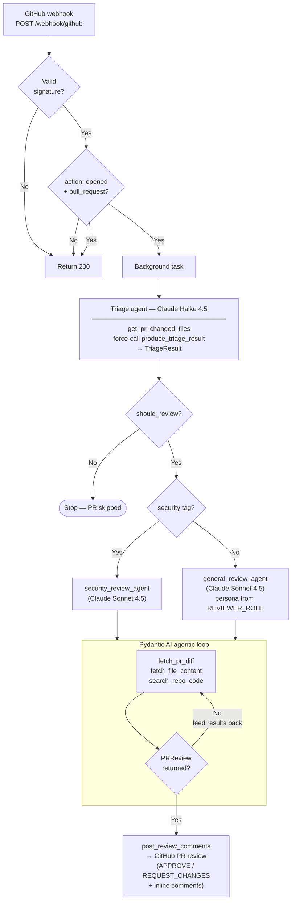

# PR Review Agent

A GitHub PR review agent powered by Pydantic AI and Anthropic. A FastAPI webhook receiver that detects new pull requests on GitHub, triages them using Claude Haiku 4.5, and runs an automated code review using Claude Sonnet 4.5.

## Prerequisites

- Python 3.12+
- [uv](https://docs.astral.sh/uv/) — fast Python package manager
- A [GitHub](https://github.com) account
- A GitHub personal access token (needs `public_repo` scope, or `repo` for private repos)
- An [Anthropic](https://console.anthropic.com/) API key
- [ngrok](https://ngrok.com) — for exposing your local server to GitHub webhooks

## Quick start

```bash
# Clone the repo
git clone https://github.com/carsten-j/pr-review-agent.git
cd pr-review-agent

# Install dependencies
uv sync

# Create your .env file
cp .env.example .env
# Edit .env and set:
#   GITHUB_WEBHOOK_SECRET — a strong random value (used for both .env and GitHub webhook config)
#     Generate one with: python -c "import secrets; print(secrets.token_hex(32))"
#   ANTHROPIC_API_KEY — your Anthropic API key
#   GITHUB_TOKEN — a GitHub personal access token
#   REVIEWER_ROLE — reviewer persona for the general agent (default: senior-dev)
#   LOGFIRE_TOKEN — (optional) write token for Logfire observability

# Start the server
uv run uvicorn pr_review_agent.main:app --reload
```

The server runs at `http://localhost:8000`. Verify with:

```bash
curl http://localhost:8000/health
```

## ngrok setup

ngrok creates a public HTTPS tunnel to your local server so GitHub can deliver webhook events to it.

### 1. Install ngrok

```bash
brew install ngrok
```

Or download from [ngrok.com/download](https://ngrok.com/download).

### 2. Create a free account

Sign up at [dashboard.ngrok.com/signup](https://dashboard.ngrok.com/signup).

### 3. Authenticate

After signing up, copy your auth token from the [ngrok dashboard](https://dashboard.ngrok.com/get-started/your-authtoken) and run:

```bash
ngrok config add-authtoken <your-token>
```

### 4. Start the tunnel

With your FastAPI server running on port 8000:

```bash
ngrok http 8000
```

You'll see output like:

```bash
Forwarding  https://a1b2c3d4.ngrok-free.app -> http://localhost:8000
```

Copy the `https://*.ngrok-free.app` URL — you'll need it for the GitHub webhook configuration.

> **Note:** On the free tier, the ngrok URL changes every time you restart the tunnel. You'll need to update the GitHub webhook URL each time. Consider upgrading to a paid plan for a stable domain if you use this regularly.

## GitHub webhook configuration

### 1. Go to your repo's webhook settings

Navigate to your test repo (e.g., `carsten-j/pr-review-test-repo`):

**Settings** → **Webhooks** → **Add webhook**

### 2. Configure the webhook

| Setting | Value |
| ------- | ----- |
| **Payload URL** | `https://<your-ngrok-url>/webhook/github` |
| **Content type** | `application/json` |
| **Secret** | The same value you set in `.env` as `GITHUB_WEBHOOK_SECRET` |

### 3. Select events

- Choose **"Let me select individual events"**
- Check **"Pull requests"** only
- Uncheck everything else

### 4. Save

Click **Add webhook**. GitHub will send a `ping` event — you'll see it logged as an ignored event (since we only process `pull_request` events), which confirms the connection works.

## Testing

### Run automated tests

```bash
uv run pytest tests/ -v
```

### Simulate a webhook locally

With the server running:

```bash
uv run python scripts/simulate_webhook.py
```

This sends a fake PR webhook with a valid HMAC signature to your local server.

### Live test

1. Start the FastAPI server (`uv run uvicorn pr_review_agent.main:app --reload`)
2. Start ngrok (`ngrok http 8000`)
3. Configure the webhook on GitHub (see above)
4. Open a PR on the test repo
5. Watch the server logs — you should see the triage result followed by the code review output

### Run integration tests

Integration tests call the real Anthropic API and are skipped by default. To run them:

```bash
uv run pytest -m integration
```

Requires `ANTHROPIC_API_KEY` to be set in your environment.

### Run evals

Evals measure output *quality* across representative cases using [`pydantic-evals`](https://docs.pydantic.dev/latest/). They run against the real Anthropic API and are excluded from the default test run.

```bash
# Run via pytest
uv run pytest -m evals -v

# Or run the standalone script (prints full reports)
uv run python evals/run_evals.py
```

Requires `ANTHROPIC_API_KEY`. Two suites are included:

- **`evals/eval_triage.py`** — 5 cases covering SQL injection, hardcoded secrets, README updates, dependency bumps, and feature PRs. Evaluators check priority/risk classification and reason quality.
- **`evals/eval_review.py`** — 4 cases covering MD5 password hashing, SQL injection, a clean refactor, and missing error handling. Evaluators check that security issues are flagged, clean code is approved, and comments are actionable.

#### Extending evals with real PR diffs

GitHub retains diff data for open, closed, and merged PRs permanently. To add real PR cases:

1. Store `(repo, pr_number)` pairs as `Case` inputs instead of inline diffs
2. Replace `FakeGitClient` with the real `GitHubClient` in the task function
3. Set `GITHUB_TOKEN` in your environment (already required for the main app)

```python
async def triage_task(inputs: TriageInputs) -> TriageResult:
    client = GitHubClient(token=os.environ["GITHUB_TOKEN"])
    return await run_triage(pr=inputs.pr, repo=inputs.repo, git_client=client)
```

## Architecture

```text
src/pr_review_agent/
├── main.py            # FastAPI app — webhook endpoint, settings, Logfire setup, background pipeline
├── models.py          # Pydantic models for GitHub payloads, triage, and review output
├── security.py        # HMAC-SHA256 signature verification
├── git_platform.py    # GitPlatformClient protocol and RepoDeps dataclass
├── github_client.py   # GitHubClient — implements GitPlatformClient via httpx
├── triage.py          # Pydantic AI triage agent (Claude Haiku 4.5)
└── review.py          # Code review agents — security + general (Claude Sonnet 4.5)
```

- **`main.py`** — Receives `POST /webhook/github`, verifies the signature, filters for `pull_request` events with `action: opened`, logs the PR details, and fires off a background pipeline (triage → review). Configures Logfire at startup via `logfire.configure()` and `logfire.instrument_pydantic_ai()`.
- **`models.py`** — Typed Pydantic models for GitHub webhook payloads, changed files, `TriageResult`, and `PRReview` output schemas.
- **`security.py`** — Verifies the `X-Hub-Signature-256` header using the shared secret. Implemented as a FastAPI dependency.
- **`git_platform.py`** — Defines the `GitPlatformClient` Protocol (abstract interface) and the `RepoDeps` dataclass that bundles `git_client`, `workspace`, `repo_slug`, and `pr_id`. Designed to support Bitbucket or other platforms in the future.
- **`github_client.py`** — `GitHubClient` implementation of `GitPlatformClient`. Owns a shared `httpx.AsyncClient` for connection pooling. Supports a configurable `base_url` for GitHub Enterprise Server.
- **`triage.py`** — Pydantic AI agent using Claude Haiku 4.5. Takes PR metadata and changed file list, produces a structured `TriageResult` with should_review, priority, risk_level, reason, and tags. Uses `TriageDeps(RepoDeps)`.
- **`review.py`** — Two Pydantic AI review agents using Claude Sonnet 4.5. A security reviewer runs when triage tags include "security", otherwise a general reviewer runs (persona configured via `REVIEWER_ROLE` setting). Both share the same tools (`fetch_pr_diff`, `fetch_file_content`, `search_repo_code`) and produce a structured `PRReview`. Uses `ReviewDeps(RepoDeps)`.

### Pipeline flow



### Triage output

The triage agent produces a `TriageResult` with:

- **should_review** — Should a review agent look at this PR?
- **priority** — `normal` or `urgent`
- **risk_level** — `low`, `medium`, `high`, or `critical`
- **reason** — 1-2 sentence explanation
- **tags** — Labels like `security`, `feature`, `bugfix`, `breaking-change`, etc.

### Review output

The review agent produces a `PRReview` with:

- **summary** — 2-3 sentence summary of the PR's intent and quality
- **risk_level** — `low`, `medium`, `high`, or `critical`
- **comments** — Line-specific review comments with severity, category, and optional code suggestions
- **architectural_observations** — Higher-level patterns and concerns across files
- **learning_points** — Key takeaways for junior developers
- **approve** — Whether the PR is safe to merge as-is

## Observability

The agent is instrumented with [Logfire](https://logfire.pydantic.dev/). When `LOGFIRE_TOKEN` is set, every PR pipeline run appears as a single trace in the Logfire UI — triage agent run, tool calls, model requests, token usage, and the final review, all nested under a `review PR {repo}#{pr_number}` root span.

To enable:

1. Create a write token at logfire.pydantic.dev → project `pr-review-agent` → Settings → Write tokens
2. Add `LOGFIRE_TOKEN=<your-token>` to `.env`
3. Start the server — traces appear in Logfire automatically

Without `LOGFIRE_TOKEN` the app runs normally with no overhead.

## What's next

- Post review comments as inline PR comments on GitHub
- Add Bitbucket support (the `GitPlatformClient` abstraction is already in place)
